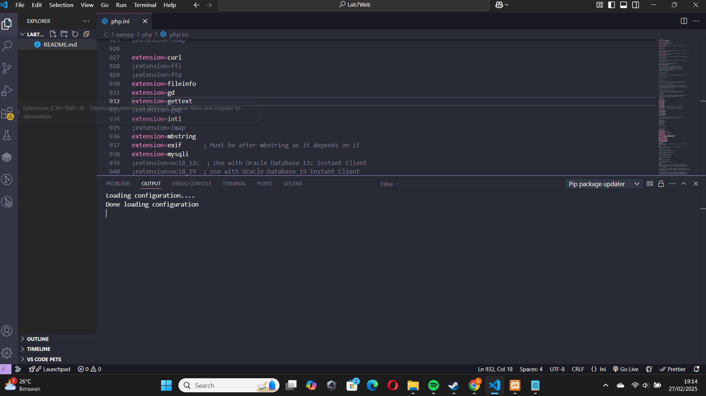
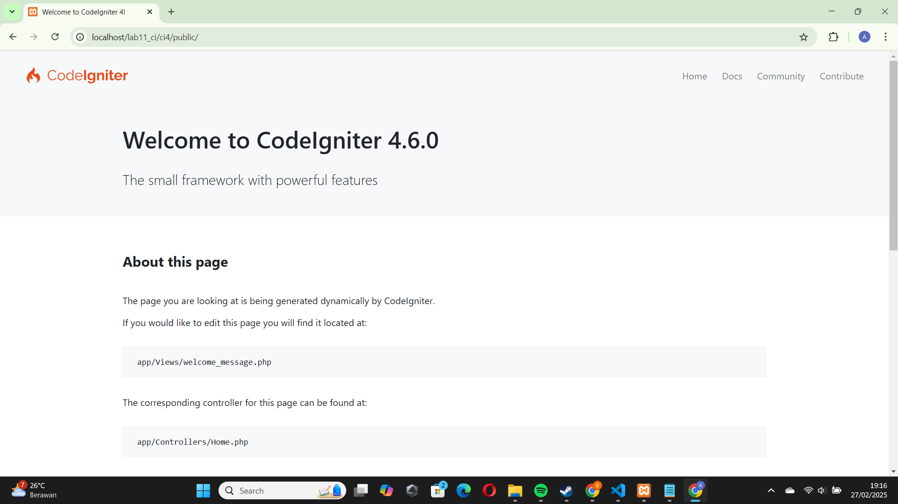
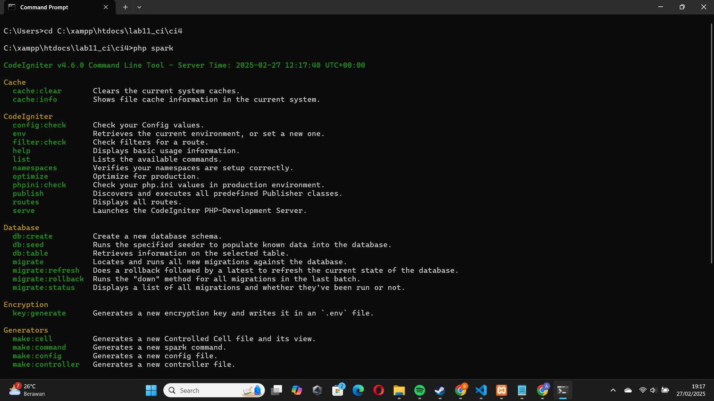
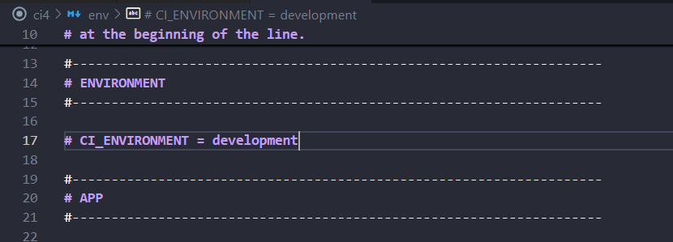
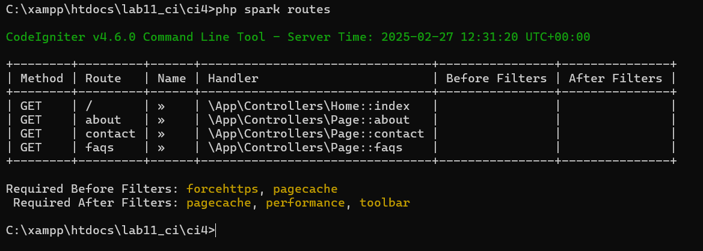
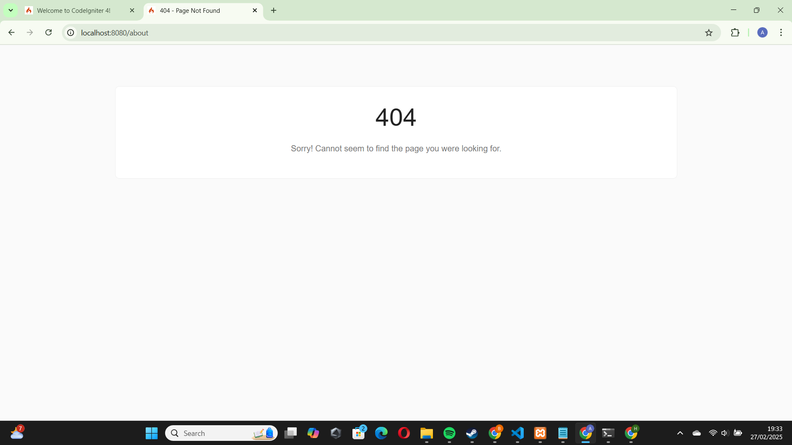
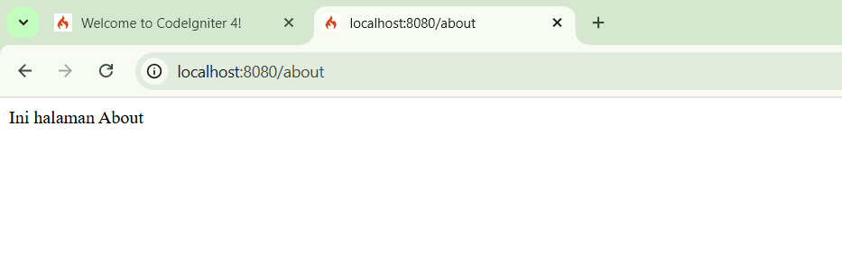
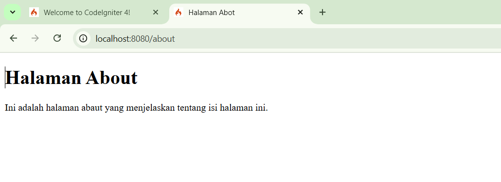
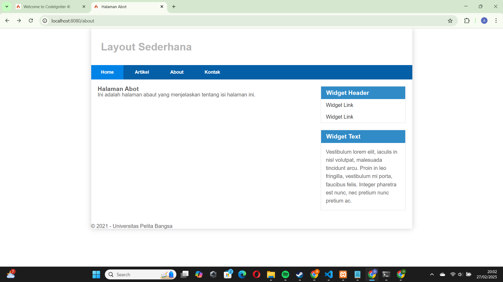

<div align="center">
  
  
</div>

# 📌 Laporan Praktikum 1: PHP Framework (CodeIgniter 4)

## 👤 Profil Mahasiswa

| Atribut         | Keterangan            |
| --------------- | --------------------- |
| **Nama**        | Alvin Alfandy         |
| **NIM**         | 312310473             |
| **Kelas**       | TI.23.A.5             |
| **Mata Kuliah** | Pemrograman Website 2 |

---

## 🎯 Tujuan Praktikum

- Memahami konsep dasar Framework.
- Memahami konsep dasar MVC.
- Membuat program sederhana menggunakan Framework CodeIgniter 4.
- Mengimplementasikan routing dan controller pada CodeIgniter.
- Membuat tampilan dengan View dan Layout menggunakan CSS.

---

## ⚙️ Langkah-Langkah Praktikum

### 📌 1. Persiapan

🔹 Mengaktifkan ekstensi PHP yang dibutuhkan melalui `php.ini`.
🔹 Restart Apache melalui XAMPP Control Panel.

📷 **Screenshot Konfigurasi PHP.ini:**



---

### 📌 2. Instalasi Codeigniter 4

🔹 Download Codeigniter 4 dari [🔗 Situs Resmi Codeigniter](https://codeigniter.com/download).
🔹 Ekstrak ke direktori `htdocs/lab11_ci/`.
🔹 Ubah nama folder menjadi `ci4`.
🔹 Akses `http://localhost/lab11_ci/ci4/public/` untuk memastikan instalasi berhasil.

📷 **Screenshot Tampilan Codeigniter 4:**



---

### 📌 3. Menjalankan CLI (Command Line Interface)

```bash
cd xampp/htdocs/lab11_ci/ci4/
php spark
```

📷 **Screenshot Hasil Perintah CLI:**



---

### 📌 4. Mengaktifkan Mode Debugging

```bash
# Buka file .env dan ubah:
CI_ENVIRONMENT = development
```

📷 **Screenshot Konfigurasi Debugging:**



---

### 📌 5. Membuat Route Baru

Tambahkan kode berikut di `app/config/Routes.php`:

```php
$routes->get('/about', 'Page::about');
$routes->get('/contact', 'Page::contact');
$routes->get('/faqs', 'Page::faqs');
```

```bash
php spark routes
```

📷 **Screenshot CLI & Error Page:**




---

### 📌 6. Membuat Controller Page

Buat file `Page.php` di `app/Controllers/`:

```php
<?php
namespace App\Controllers;
class Page extends BaseController {
    public function about() { echo "Ini halaman About"; }
    public function contact() { echo "Ini halaman Contact"; }
    public function faqs() { echo "Ini halaman FAQ"; }
}
```

📷 **Screenshot Tampilan About Page:**



---

### 📌 7. Membuat View

Buat file `app/Views/about.php`:

```php
<!DOCTYPE html>
<html>
<head>
    <title><?= $title; ?></title>
</head>
<body>
    <h1><?= $title; ?></h1>
    <p><?= $content; ?></p>
</body>
</html>
```

📷 **Screenshot Tampilan View About Page:**



---

### 📌 8. Membuat Layout Web dengan CSS

- Simpan file `style.css` di `public/`
- Buat `header.php` dan `footer.php` di `app/Views/template/`
- Ubah `about.php` agar menggunakan `include`:

```php
<?= $this->include('template/header'); ?>
<h1><?= $title; ?></h1>
<p><?= $content; ?></p>
<?= $this->include('template/footer'); ?>
```

📷 **Screenshot :**



### 📌 9. 🚀 Menambahkan Halaman Baru (Services) dan (Artikel)

Agar website lebih lengkap, kita akan menambahkan halaman `Services` dan `Artikel` pilkan informasi layanan yang disediakan. yang menampilkan informasi layanan yang disediakan.

🛠 **Langkah 1: Menambahkan Route untuk Halaman Services**
Tambahkan route baru di `app/Config/Routes.php`, sehingga halaman ini dapat diakses melalui URL:

```php
$routes->get('/services', 'Page::services');
```

📝 **Langkah 2: Membuat Method dalam Controller**
Tambahkan method `services()` di `app/Controllers/Page.php` agar controller bisa menghandle request halaman `Services`:

```php
public function services() {
    return view('services', [
        'title' => '💼 Halaman Services',
        'content' => 'Kami menyediakan berbagai layanan, mulai dari konsultasi IT hingga pengembangan software. Hubungi kami untuk informasi lebih lanjut!'
    ]);
}
```

🎨 **Langkah 3: Membuat View untuk Halaman Services**
Buat file baru `app/Views/services.php` dan isi dengan kode berikut untuk tampilan halaman:

```php
<?= $this->include('template/header'); ?>
<h1>🛠 <?= $title; ?></h1>
<p>📌 <?= $content; ?></p>
<?= $this->include('template/footer'); ?>
```

🌐 **Langkah 4: Mengakses Halaman Services**
Setelah semua selesai, buka browser dan akses:

```
http://localhost:8080/services
```

Jika semua sudah berjalan dengan baik, halaman `Services` akan tampil dengan informasi layanan yang tersedia. 🎉

📷 **Screenshot Tampilan Halaman Services:**


Pada langkah ini, kita akan menambahkan halaman baru bernama `Services` agar dapat diakses melalui URL.

## 📄 Menambahkan Halaman Artikel

Karena di navigasi ada menu `Artikel`, kita juga harus membuat halamannya.

🛠 **Langkah 1: Menambahkan Route untuk Halaman Artikel**
Tambahkan kode berikut di `app/Config/Routes.php`:

```php
$routes->get('/artikel', 'Page::artikel');
```

📝 **Langkah 2: Membuat Method dalam Controller**
Tambahkan method `artikel()` di `app/Controllers/Page.php`:

```php
public function artikel() {
    return view('artikel', [
        'title' => '📰 Halaman Artikel',
        'content' => 'Selamat datang di halaman artikel. Di sini Anda dapat membaca berbagai artikel menarik yang kami sajikan.'
    ]);
}
```

🎨 **Langkah 3: Membuat View untuk Halaman Artikel**
Buat file baru `app/Views/artikel.php` dan isi dengan kode berikut:

```php
<?= $this->include('template/header'); ?>
<h1>📰 <?= $title; ?></h1>
<p>📖 <?= $content; ?></p>
<?= $this->include('template/footer'); ?>
```

🌐 **Langkah 4: Mengakses Halaman Artikel**
Setelah semua selesai, buka browser dan akses:

```
http://localhost:8080/artikel
```

Jika semua sudah berjalan dengan baik, halaman `Artikel` akan tampil dengan kontennya. 🎉

📷 **Screenshot Tampilan Halaman Artikel:**


✅ Kesimpulan

Hasil Praktikum
Dari praktikum ini, kita telah memahami dasar-dasar penggunaan framework CodeIgniter 4, termasuk:

Struktur direktori dan konfigurasi awal CodeIgniter.

Mengaktifkan dan mengonfigurasi CodeIgniter 4 untuk pengembangan aplikasi.

Menjalankan aplikasi menggunakan Command Line Interface (CLI).

Membuat dan mengelola routing untuk berbagai halaman dalam website.

Menggunakan Controller dan View untuk menampilkan konten dinamis.

Menerapkan layout dengan template header dan footer.

Menambahkan halaman Services dan Artikel agar website lebih informatif.

✨ Kesimpulan
Dengan menyelesaikan praktikum ini, kita telah mendapatkan wawasan mendalam tentang bagaimana CodeIgniter 4 mempermudah pengembangan aplikasi web. Framework ini menawarkan struktur yang lebih terorganisir, efisien, dan fleksibel, yang sangat membantu dalam membangun aplikasi berbasis web secara lebih profesional. 🚀🔥
Dari praktikum ini, kita telah memahami konsep dasar penggunaan framework CodeIgniter 4, termasuk struktur direktori, konfigurasi awal, serta implementasi konsep MVC (Model-View-Controller). Selain itu, kita juga telah berhasil:

- Mengaktifkan dan mengkonfigurasi CodeIgniter 4.
- Menjalankan aplikasi menggunakan Command Line Interface (CLI).
- Membuat dan mengelola routing untuk halaman-halaman dalam website.
- Membuat Controller dan View untuk menampilkan konten dinamis.
- Mengimplementasikan layout menggunakan template header dan footer.
- Menambahkan halaman Services dan Artikel agar website lebih lengkap.

Dengan menyelesaikan praktikum ini, kita mendapatkan pemahaman yang lebih baik tentang bagaimana CodeIgniter 4 mempermudah pengembangan aplikasi berbasis web dengan struktur yang lebih terorganisir dan efisien. 🚀
